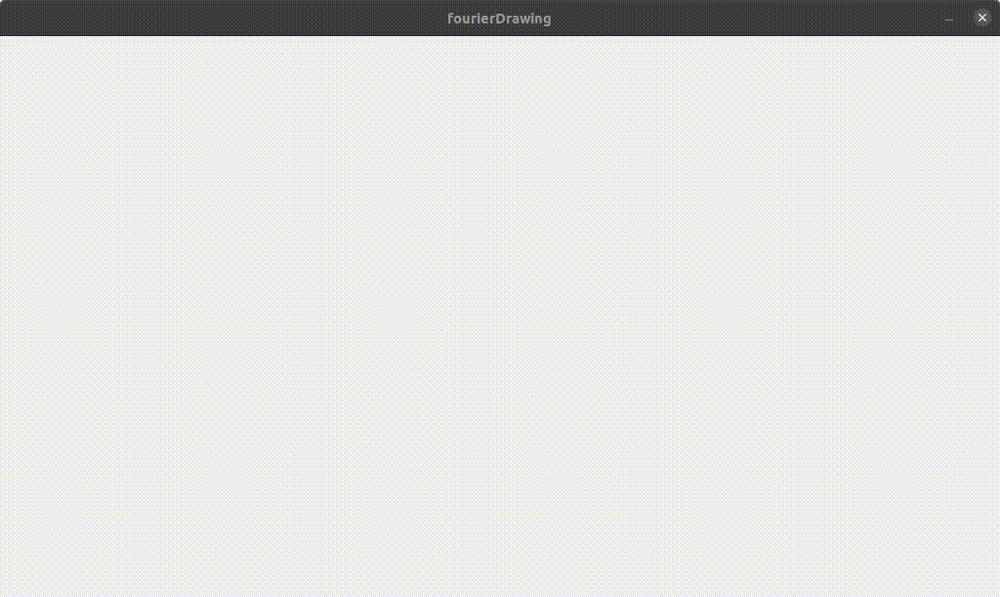

# Fourier Drawing Simulation
This is code to redraw any drawing with constantly rotating circles.

Software Used
------
* [Processing](https://processing.org) was used as the front-end framework in which this code runs. As this is a Processing app, it needs the use of Processing software to run.
* The [FFT algorithm](https://commons.apache.org/proper/commons-math/javadocs/api-3.4/org/apache/commons/math3/transform/FastFourierTransformer.html) was the main basis for extracting the amplitudes and phase shifts from the sets of data. This code uses the Apache CommonsMath3 library for the transform functions and the handling of the resulting complex numbers.

Controls
------
* Click to start a path, and move the mouse to draw. Click again to end that path.
* Once you're done drawing all paths, hitting the space bar will generate rotating circles to trace your paths.

Example
-----

